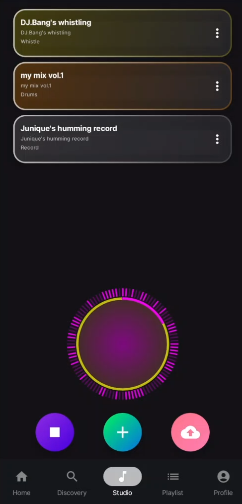
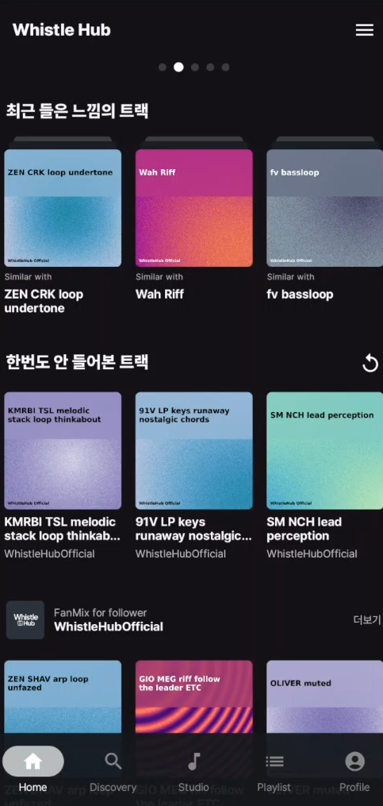
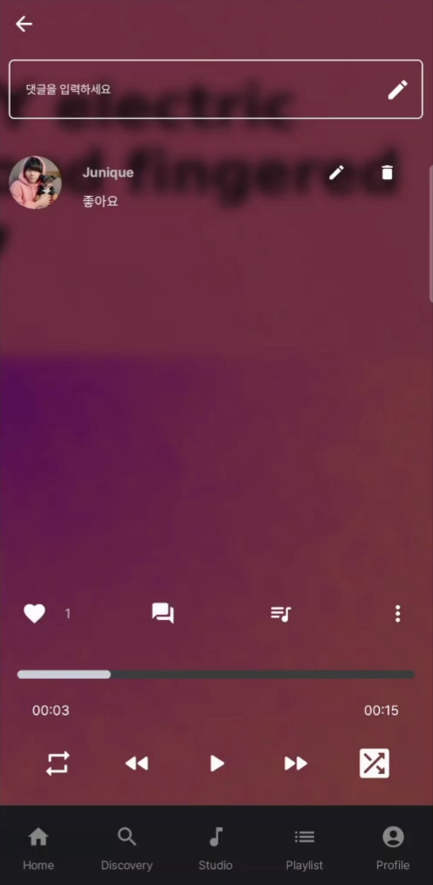
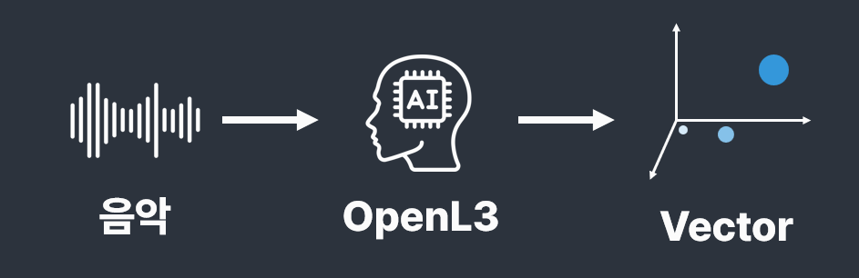
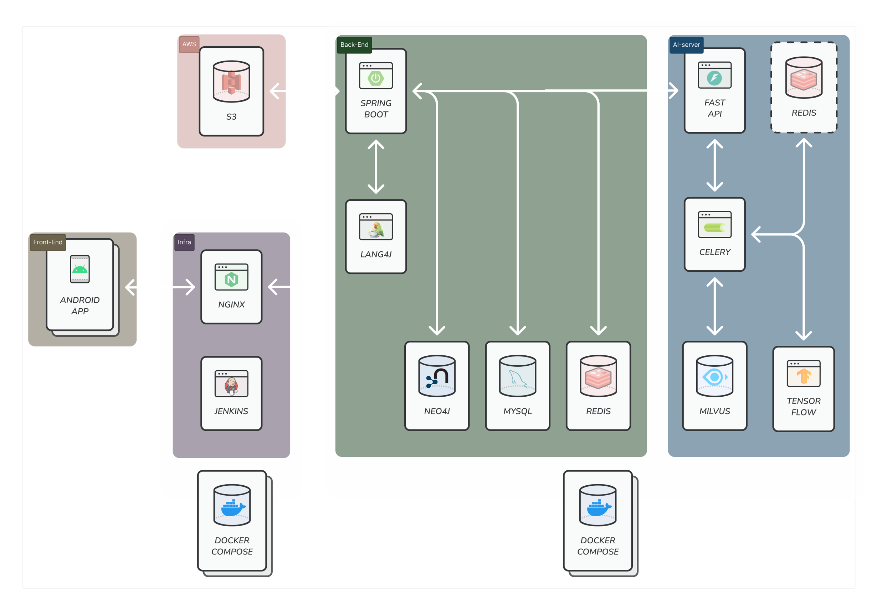

# 🎶 Whistle Hub - 누구나 쉽게 즐기는 AI 기반 협업 작곡 플랫폼

Whistle Hub는 음악 제작 경험이 없는 사람도 **휘파람 하나로 시작해 곡을 만들고, AI 추천과 커뮤니티를 통해 음악을 함께 완성**할 수 있도록 돕는 **모바일 작곡 플랫폼**입니다.

---

## 📽️ 프로젝트 개요

> "쉬운 작곡 · 빠른 추천 · 함께하는 음악"

- 어려운 DAW 사용 없이, 간단한 녹음과 편집으로 음악을 만들 수 있습니다.
- 휘파람 녹음만으로 드럼, 베이스, 멜로디 등 어울리는 사운드를 AI가 자동 추천합니다.
- 다른 유저들과 협업하고 소통할 수 있는 커뮤니티 기반 음악 플랫폼입니다.

---

## 🔧 주요 기능

### 🎼 작곡 & 워크스테이션

- **레이어 단위 편집**: 보컬, 드럼, 기타 등 악기별 녹음 및 마디 편집
- **Import 기능**: 다른 유저의 레이어를 내 트랙에 가져오기
- **AI 레이어 추천 기능**: 음원의 유사도, 상황 기반 추천

### 🔍 추천 시스템

- **유사 음악 추천**: 소리 특징 벡터화(OpenL3) + 그래프 탐색(Neo4j)
- **개인화 추천**: 사용자의 감상 패턴, 선호도, 컨텐츠 기반 추천 + 협업 필터링

### 🌐 커뮤니티 기능

- 트랙 공유, 댓글, 좋아요, 팔로우

### 🧠 AI 기반 유사도 측정

- OpenL3모델을 활용한 음원 분석
- BPM/음역대/악기 추론 기반 정밀 태깅

---

## ⚒️ 기술 스택

### 전체 아키텍처

### 📱 클라이언트

- **Native Android** (Kotlin)
- **Oboe + JNI**: 저지연 오디오 처리

### 🖥️ 서버

- **Spring Boot**: REST API 서버로, 클라이언트/DB와 상호작용
- **FastAPI**: OpenL3 모델 기반 소리 임베딩 처리

### 🗄 데이터베이스

- **MySQL**: 회원 및 트랙 메타데이터 저장
- **Milvus**: 음악 벡터 인덱싱 및 유사도 계산
- **Redis**: Celery Task, 음원 랭킹정보 저장
- **Neo4j**: 트랙 유사도, 태그관계, 유저 선호도 관계 저장 및 탐색

---

💡 기대 효과

- 음악 제작에 대한 진입장벽을 낮춤으로써 숏폼/영상 플랫폼을 위한 음악 콘텐츠 생성이 증가

- 사용자 커뮤니티 기반 협업 생태계로 발전 가능

- 추천 알고리즘을 통한 음악 소비 다각화 및 개인화
